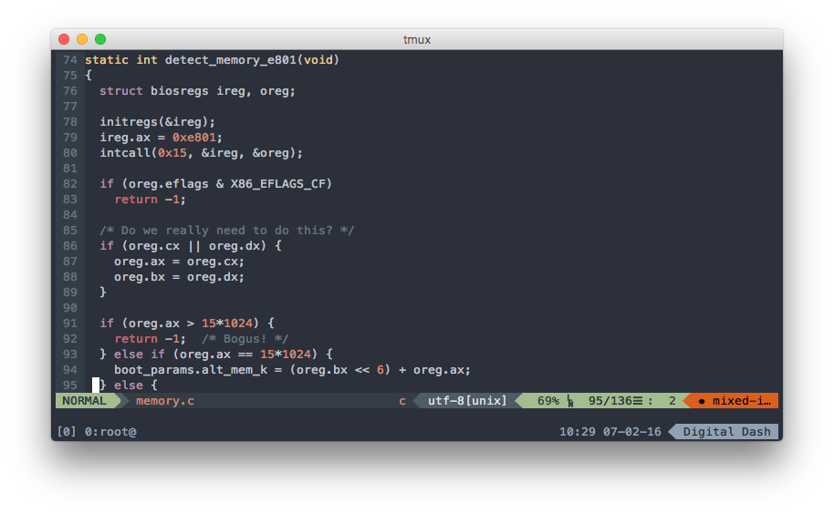

# True Color mode cho VIM và Tmux

Tuần vừa rồi mình và hội "VIM thủ" ở cộng đồng Ruby Việt Nam rủ nhau dành hẳn ra một tuần làm việc để ngồi cài VIM cùng mấy thứ đồ chơi linh tinh cho nó. Mặc dù kết quả rất khả quan là dến cuối tuần thì hầu như tất cả đã có được cho mình một bộ môi trường terminal hoàn hảo gồm có iTerm hoặc Cygwin chạy Tmux và VIM ở chế độ True Color, màu mè thì đẹp khỏi chê, nhưng mà gần một tuần không làm ăn được gì cả =))

Quá trình cài đặt cũng không quá phức tạp, tuy nhiên nó khá là dài dòng và lôi thôi, lại có nhiều lỗi phát sinh tùy theo môi trường hiện hành của mỗi máy tính, vì thế mình viết bài này để lưu lại, phòng khi về sau máy móc có dở chứng thì cũng còn có thứ lấy ra tham khảo lại. Cũng tiện thể làm tài liệu hướng dẫn, dễ bề lôi kéo thêm nhiều bạn gia nhập vào hội cuồng terminal của bọn mình :v  

Nếu có thắc mắc về VIM hoặc Tmux hoặc True Color là gì, các bạn có thể để lại câu hỏi trong phần comment, còn bây giờ mình xin phép bắt đầu phần cài đặt luôn.

À mà trước khi bắt đầu thì cũng nên khoe thành phẩm một tí để các bạn dễ hình dung, lỡ nếu thấy không hứng thú thì close luôn cho tiện :)) vì chặn đường phía trước rất là gian khổ, hứa hẹn tốn không ít thời gian của các bạn =))

Các yếu tố cần thiết để cài đặt một trình soạn thảo 

## Bước 1: Kiểm tra xem terminal có hỗ trợ 24-bit màu không

