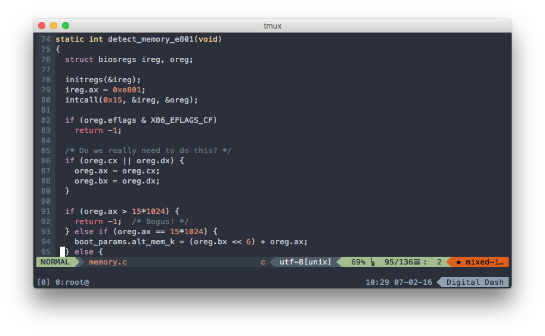

Tình hình là mình chuyển qua dùng Vim làm editor chính cho cả công việc lẫn mấy việc lặt vặt (side projects, blog,...) cũng được hơn 1 tháng rồi. Thực ra dùng lâu rồi nhưng thấy ko quen nên bỏ :v bây giờ quyết định chuyển hẳn qua và tập sử dụng một cách nghiêm túc.

Viết bài này chia sẽ một vài kinh nghiệm thường gặp trong quá trình sử dụng editor này, hy vọng sẽ giúp ích cho các bạn nào cũng đang sử dụng nó như mình.

## Nếu có thể thì hãy dùng Neovim

NeoVim là một phiên bản mở rộng của Vim và tất nhiên là hoàn toàn tương thích với các plugins/config cũ của Vim. Điểm đặc biệt của NeoVim là khả năng chạy asynchronous cho các plugins. Điều này cho phép các plugins chạy nhanh hơn vì nó được thực hiện trên 1 thread khác, và nhiều plugins cùng chạy một lúc là điều khả thi. Ví dụ cho chức năng này là bạn vừa có thể chạy lệnh `:GoTest` vừa code tiếp và chức năng `AutoComplete` vẫn hoạt động ngon lành.

Và một điểm thú vị nữa là phiên bản `HEAD` trên `brew` đã hỗ trợ sẵn true-color, giúp cho việc tùy biến màu sắc của NeoVim đa dạng hơn.

## Sử dụng vim-airline

Lúc đầu mình không thích dùng vim-airline lắm vì cho rằng nó không cần thiết. Nhưng sau khi cài vào dùng thử thì thấy nó cũng ngon phết. Nó giúp hiển thị được thêm nhiều thông tin cần thiết nên chỉ cần liếc mắt nhìn một phát là thấy ngay, không cần phải lọ mọ gõ lệnh để tìm, ví dụ như định dạng file hiện tại, encoding của file, endcoding của line ending, vị trí hiện tại của con trỏ trong file,...

## Sử dụng ctrlp.vim

Đây là một plugin do một anh bạn người Việt Nam làm ra! Việc ủng hộ hàng VN là điều khỏi phải bàn cãi. Tuy nhiên còn có lý do khác. Đó là khả năng tìm nhanh tên file bằng thuật toán `Fuzzy Search` giúp cho việc truy cập, chuyển đổi qua lại giữa các file nhanh chóng hơn, từ khi dùng plugin này thì mình cũng không cần phải tìm cách hiển thị cây thư mục trong Vim nữa.

## Tìm kiếm trong 1 file

Các bạn có thể tìm nhanh một cụm từ trong một file bằng phím `/`. Gõ phím này rồi gõ vào nội dung cần tìm (nó là RegEx nhé, nên nếu muốn tìm có dấu cách `space` thì gõ là `\ ` thay vì khoảng trắng bình thường), xong rồi gõ `Enter` để bắt đầu tìm. Tìm tiếp bằng phím `n`.

Gõ `:nohlsearch` để bỏ việc highlight từ khóa sau khi đã tìm đến nơi cần thiết.

Ngoài ra, nếu muốn highlight nhanh một từ khóa nào đó trong file hiện tại, các bạn có thể đưa con trỏ đến từ khóa đó và nhấn phím `#`.

## Tìm kiếm toàn bộ thư mục của project

Để tìm trong toàn bộ tất cả thư mục của project, các bạn nên dùng `Ag` (The Silver Searcher). Chi tiết về cách cấu hình `Ag` có thể xem tại [ThoughtBot - Faster Grep in Vim](https://robots.thoughtbot.com/faster-grepping-in-vim).

## Indent code

Một trong những thao tác quan trọng nhất là việc thò ra thụt vào cho code =)) à ý là căn lề cho code, các bạn đừng có nghĩ bậy nhé.

### Thò ra

**Cách 1:** Bôi đen code bằng visual mode (gõ phím `v` rồi di chuyển con trỏ để chọn vùng code cần bôi).

Gõ `Shift + .` (tức là phím `>`) để đẩy khối code về bên phải.

**Cách 2:** Không cần bôi đen, gõ `>` + `số dòng cần thò` + `j`

### Thụt vào

**Cách 1:** Tương tự như trên, bôi đen đoạn code cần căn lề.

Gõ `Shift + ,` (tức là phím `<`) để kéo đoạn code đang chọn về bên trái.

**Cách 2:** Tương tự, gõ `<` + `số dòng cần thụt` + `j`

### Tự động căn lề

Để tự động căn lề một đoạn code cho đẹp mắt, bạn làm như sau:

**Cách 1:** Bôi đen đoạn code cần căn lề bằng visual mode.

Gõ phím `=` và đoạn code sẽ được tự động căn chỉnh.

**Cách 2:** Căn lề từ đầu tới cuối file luôn. Chỉ cần gõ `gg=G`.

---

Trên đây là một vài thủ thuật mình thường dùng khi sử dụng Vim. Hy vọng nó có ích cho các bạn.

Nếu các bạn cảm thấy Vim quá phức tạp và rối rắm vì phải nhớ những phím tắt rắc rối thì đó là bạn đang học sử dụng Vim sai cách rồi, đừng bao giờ cố nhớ một tổ hợp phím tắt hoặc một lệnh nào trong Vim cả, mà hãy dùng nó theo phương pháp: "Learn as you go", tức là khi cần dùng cái gì thì lên mạng tra cứu cái đó, và sử dụng nó cho đến khi thành thạo.

Happy vimming ^^
