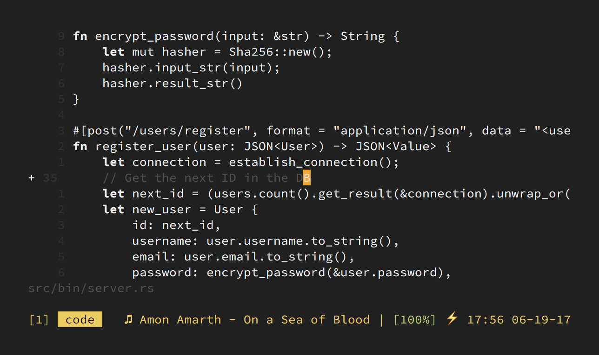

Độ hơn 1 tháng nay thì mình chuyển sang chế độ "chay tịnh" trong Vim.

Đó là tắt luôn chức năng Syntax Highlighting... đưa màn hình code về dạng nguyên thủy nền đen chữ trắng 😆.

Okay, mình biết là bạn đang nghĩ gì, không phải tại mình bị điên đâu :)) việc làm này đem lại hiệu quả cực kì lớn đấy.

- Giúp bạn tập trung hơn khi code
- Giúp tăng khả năng đọc code của bạn lên rất nhiều
- Vì không còn màu sắc nên bạn phải chú ý hơn tới việc trình bày code cho gọn gàng sạch đẹp
- Bạn sẽ bớt code ẩu hơn
- ~~Khiến bạn trông ngầu hơn khi code~~

Thực ra nếu để ý kĩ thì giao diện mình đang xài không hoàn toàn là không màu. Nó vẫn có 2 màu chủ đạo là **trắng** và **ít trắng hơn** :))) bên cạnh đó còn có 2 kiểu hiển thị là **in đậm** và **in không đậm** nữa.

Đây là kết quả sau quá trình sử dụng và "optimize" cái giao diện để làm việc thoải mái nhất có thể.

Và mình cũng không phải là người duy nhất làm cái trò này :v

- [1] https://www.robertmelton.com/project/syntax-highlighting-off/
- [2] https://dudzik.co/digress-into-development/syntax-off/
- [3] http://www.linusakesson.net/programming/syntaxhighlighting/
- [4] https://groups.google.com/forum/#!msg/golang-nuts/hJHCAaiL0so/kG3BHV6QFfIJ
- [5] https://www.quora.com/How-does-Linus-Torvalds-program
- [6] http://howivim.com/2016/damian-conway/
- [7] https://twitter.com/enneff/status/710071512330477568
- [8] https://www.youtube.com/watch?feature=player_embedded&v=dkZFtimgAcM#t=15m58s

Tất nhiên khi mới bắt đầu thì không dễ dàng gì vì gần như ngay từ lần đầu tiên bắt đầu học lập trình thì mình đã sử dụng syntax highlighting rồi. Tuy nhiên điều khá bất ngờ là mình trở nên quen với việc code không màu này rất nhanh (chưa đầy nửa ngày).

Nếu bạn nào có hứng thú thì có thể xài thử color scheme do mình modify lại từ bộ màu **base16-ocean** tại đây:

- [9] https://gist.github.com/huytd/8394f21bda3a08be025813c060d64e75

Hãy thử dành ra một tuần hoặc lâu hơn để sử dụng thử và tự mình cảm nhận nhé :D

Happy vimming ^^
