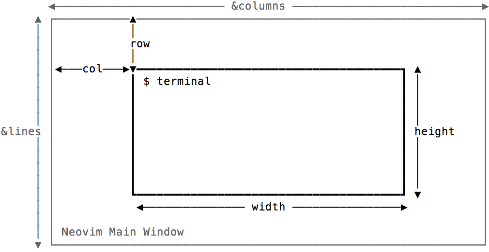
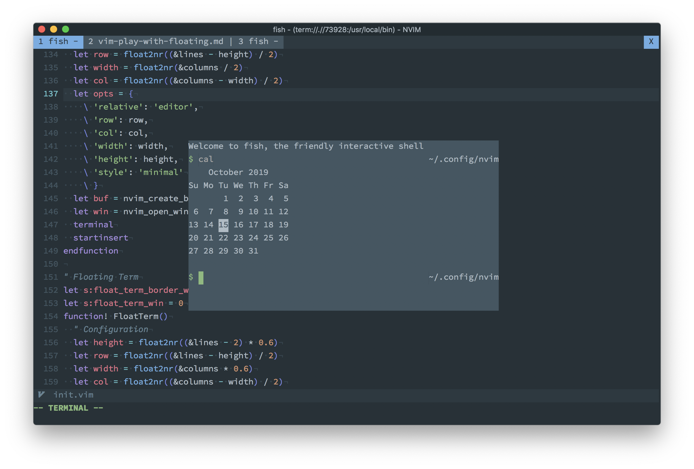
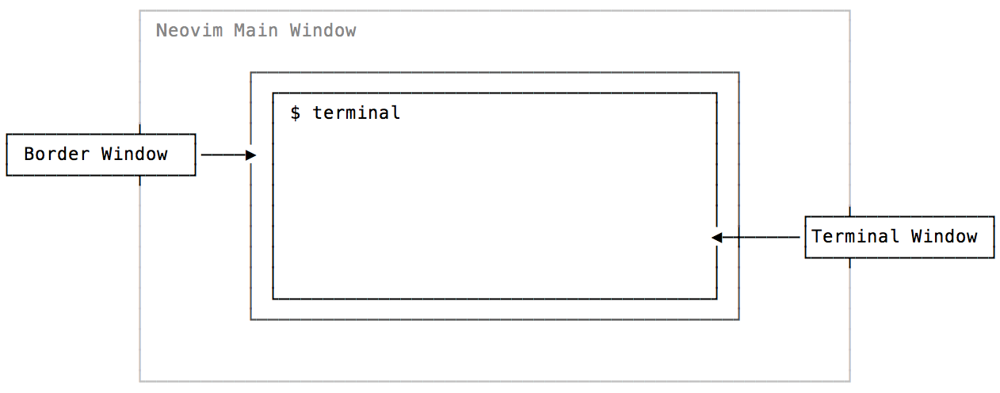
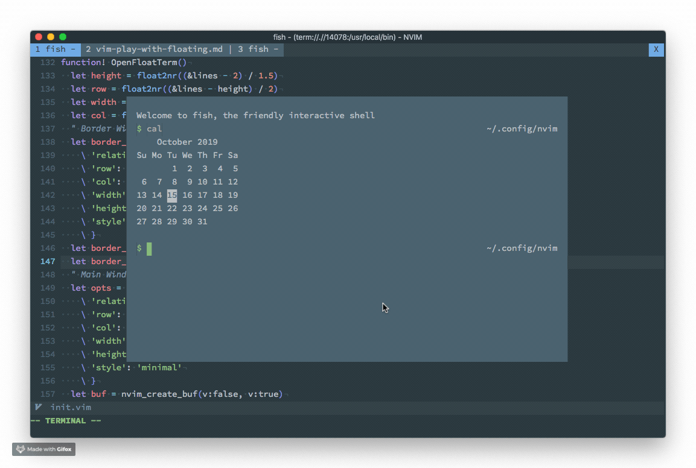
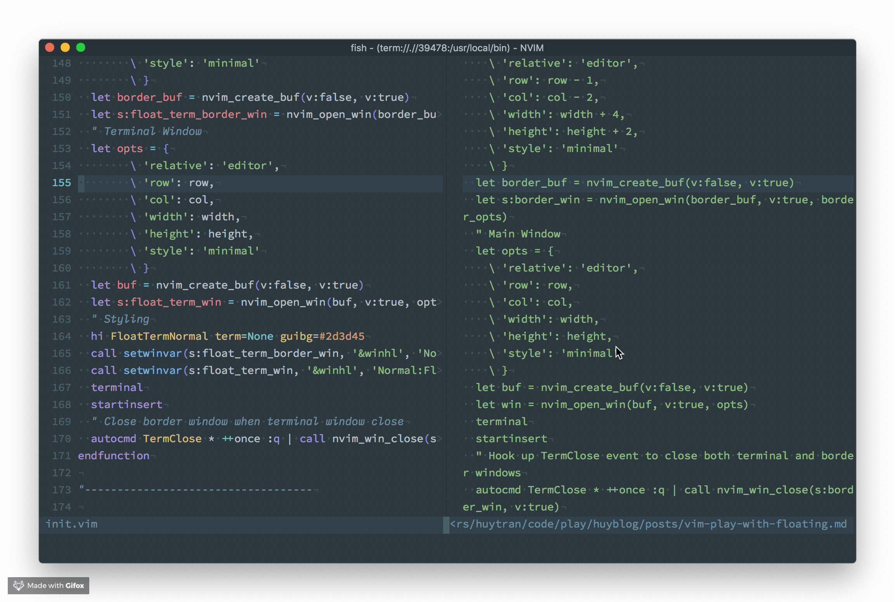

Trước khi bắt đầu: Nếu vì lý do gì đó mà bạn quyết định không đọc bài viết này vì bạn đang xài VSCode và thấy nó đủ xịn với bạn rồi, thì hãy suy nghĩ lại, đọc [bài này](https://thefullsnack.com/posts/vim-setup-2019.html), và tải về [phiên bản Vim mình đã build](https://github.com/huytd/vim-config). Nó không chỉ có mọi thứ hay ho mà VSCode có, mà còn có nhiều thứ khác xịn hơn mà VSCode không hề có.

---

Neovim từ phiên bản 0.4 có một chức năng cực kì hay ho đó là `floating windows`, giúp hiển thị một buffer ở bất kì vị trí nào trên màn hình. Nên nhớ là chúng ta đang nói đến Neovim, một editor hoạt động trên terminal, nơi mà mọi thứ chỉ là text và không hề có các khái niệm về giao diện đồ họa.

Sau khi chức năng này được release thì cộng đồng Neovim đã adopt nó khá nhanh, rất nhiều plugin áp dụng nó khá hiệu quả ví dụ như [coc.nvim][1] hay [denite.nvim][2].

[1]: https://github.com/neoclide/coc.nvim
[2]: https://github.com/Shougo/denite.nvim/

Trong bài viết này, chúng ta sẽ cùng tìm hiểu về floating window thông qua việc build một chức năng giúp cho Neovim có thể mở nhanh một cửa sổ terminal emulator, nằm floating trên màn hình. Mình thường dùng chức năng này khi cần thực hiện nhanh một thao tác nào đó như tạo git branch, push hoặc pull code mà lười xài Tmux.


## Tìm hiểu API của Neovim

Neovim đã có sẵn terminal emulator built in, đó là lệnh `:terminal`, khi chạy lệnh này, cửa sổ hiện tại sẽ được thay thế bằng một terminal buffer. Vậy, ý tưởng sẽ là: Tạo một cửa sổ mới, làm cho nó float ở giữa màn hình và chạy lệnh `:terminal` trong đó.

Theo như [document về floating windows][3] để tạo một floating window, chúng ta cần hai thứ: **1) một buffer** và **2) gọi hàm `nvim_open_win()` trên buffer đó**.

[3]: https://neovim.io/doc/user/api.html#api-floatwin

Để tạo mới một buffer, ta có thể dùng hàm `nvim_create_buf()`. Kết hợp hai hàm
này với nhau như thế này:

```
let buf = nvim_create_buf(v:false, v:true)
let opts = {
  \ 'relative': 'cursor',
  \ 'width': 10, 'height': 2,
  \ 'col': 0, 'row': 1,
  \ 'anchor': 'NW',
  \ 'style': 'minimal'
  \ }
let win = nvim_open_win(buf, 0, opts)
```

Nói qua về đối tượng `opts`, đây là các thông số thiết lập cho cửa sổ sẽ được tạo, có mấy thông số cần nói tới như là:

- `relative`: cho biết cửa sổ mới sẽ có tọa độ dựa trên đối tượng nào, nếu là `editor` thì tọa độ sẽ dựa trên toàn bộ màn hình Vim, là `win` thì tọa độ sẽ dựa trên split window hiện hành, là `cursor` thì tọa độ sẽ dựa trên vị trí con trỏ hiện tại (dùng trong trường hợp làm autocomplete chẳng hạn).
- `style`: hiện chỉ nhận 1 giá trị là `minimal`, nếu truyền giá trị này thì các thành phần như line number, cursor line,... sẽ được ẩn đi hết.
- Mấy thông số như `width`, `height` chắc khỏi cần nói tới.
- Còn `col` và `row` là để chỉ định tọa độ ban đầu của cửa sổ.

Cả hai hàm `nvim_create_buf()` và `nvim_open_win()` đều trả về id của buffer /
floating window vừa tạo ra, chúng ta sẽ dùng các id này khi cần thực hiện các
thao tác thiết lập khác.

## First implementation

Như vậy, chúng ta đã biết cần phải sử dụng những hàm nào trong API của Neovim để
có thể implement chức năng floating terminal. Cụ thể các bước cần thực hiện là:

1. Tạo một buffer mới
2. Tạo floating window từ buffer này
3. Khởi động terminal emulator trên buffer vừa tạo với lệnh `:terminal`

Ngoài ra, chúng ta muốn cửa sổ được tạo ra phải nằm chính giữa màn hình, trong
trường hợp này, Neovim có hai biến `&lines` và `&columns` cho chúng ta biết kích
thước của toàn bộ màn hình Neovim là bao nhiêu, để có thể tính toán ra các giá
trị `width`, `height`, `row` và `col` thích hợp.



Mặc định, sau khi khởi tạo terminal trong một buffer, thì buffer đó vẫn còn
trong chế độ Normal Mode, để tiện hơn chúng ta có thể dùng lệnh `startinsert`,
đưa buffer đó vào chế độ Insert Mode luôn.

Implement như sau (chắc không nói thì các bạn cũng biết là chúng ta đang gõ vào
file `init.vim`):

```
function! OpenFloatTerm()
  let height = float2nr((&lines - 2) / 1.5)
  let row = float2nr((&lines - height) / 2)
  let width = float2nr(&columns / 1.5)
  let col = float2nr((&columns - width) / 2)
  let opts = {
    \ 'relative': 'editor',
    \ 'row': row,
    \ 'col': col,
    \ 'width': width,
    \ 'height': height,
    \ 'style': 'minimal'
    \ }
  let buf = nvim_create_buf(v:false, v:true)
  let win = nvim_open_win(buf, v:true, opts)
  terminal
  startinsert
endfunction
```

Xong rồi, giờ reload Neovim và chạy thử, kết quả sẽ như hình:

```
:so % | call OpenFloatTerm()
```



Trông cũng xịn phết! Nhưng mà hơi xấu một tí.

Hiện tại thì Neovim chưa hỗ trợ các thành phần như margin, padding hay border
cho floating windows, nên nhìn cái cửa sổ terminal hiện lên chưa đã con mắt cho
lắm.

Trong phần tiếp theo, chúng ta sẽ cùng tìm cách fix.

## Second implementation: Cải tiến giao diện

Có một trick, hơi hacky một tí để giải quyết vấn đề padding đó là tạo một cửa sổ
to hơn nằm bên dưới cửa sổ terminal hiện tại, trông như thế này:



Lưu ý, vì Neovim là môi trường text mode, một ô trên màn hình sẽ là một hình chữ
nhật đứng, có tỉ lệ gần như là 1:2, nên việc tính lại tọa độ cũng như kích thước
của cửa sổ làm border cũng sẽ được thực hiện với tỉ lệ 1:2.

Tọa độ của cửa sổ border sẽ nằm về phía trên và bên trái của cửa sổ terminal,
tương tự kích thước của cửa sổ border cũng sẽ dài và cao hơn cửa sổ terminal:

<math>
\text{column}_\text{ border} = \text{column}_\text{ main} - 2 \\
\text{row}_\text{ border} = \text{row}_\text{ main} - 1 \\
\\
\text{width}_\text{ border} = \text{width}_\text{ main} + 4 \\
\text{height}_\text{ border} = \text{height}_\text{ main} + 2
</math>

Hàm `OpenFloatTerm()` bây giờ sẽ có 2 bước:

```
function! OpenFloatTerm()
  let height = float2nr((&lines - 2) / 1.5)
  let row = float2nr((&lines - height) / 2)
  let width = float2nr(&columns / 1.5)
  let col = float2nr((&columns - width) / 2)
  " Border Window
  let border_opts = {
    \ 'relative': 'editor',
    \ 'row': row - 1,
    \ 'col': col - 2,
    \ 'width': width + 4,
    \ 'height': height + 2,
    \ 'style': 'minimal'
    \ }
  let border_buf = nvim_create_buf(v:false, v:true)
  let border_win = nvim_open_win(border_buf, v:true, border_opts)
  " Main Window
  let opts = {
    \ 'relative': 'editor',
    \ 'row': row,
    \ 'col': col,
    \ 'width': width,
    \ 'height': height,
    \ 'style': 'minimal'
    \ }
  let buf = nvim_create_buf(v:false, v:true)
  let win = nvim_open_win(buf, v:true, opts)
  terminal
  startinsert
endfunction
```

Giờ chạy thử xem:



Trông có vẻ thuận con mắt hơn tí rồi. Nhưng mà chúng ta lại gặp bug! Khi đóng
cửa sổ terminal thì cửa sổ border nó vẫn còn nằm yên không chịu biến mất.

Nguyên nhân thì rõ ràng, chúng ta chỉ tương tác với cửa sổ terminal mà không làm
gì cửa sổ border hết. Để giải quyết vấn đề này, chúng ta có hàm `nvim_close_win()`, dùng để đóng một
cửa sổ bất kì, ta có thể gọi hàm này khi cửa sổ terminal bị đóng.

Làm sao để biết khi nào cửa sổ terminal bị đóng?

Lại tra tài liệu, chúng ta sẽ thấy [sự kiện TermClose](https://neovim.io/doc/user/autocmd.html#TermClose) được gọi khi chúng ta rời khỏi chế độ Terminal. Để bắt sự kiện này, ta dùng lệnh `autocmd`, như thế này:

```
autocmd TermClose * ++once :q | call nvim_win_close(<window-id>, v:true)
```

Tham số `*` ở đây có nghĩa là lệnh áp dụng cho mọi buffer, tham số `++once` sẽ làm cho lệnh này chỉ thực thi 1 lần. Đồng thời, khi terminal bị tắt, Neovim sẽ không đóng buffer chứa terminal đó đi, mà hiện dòng chữ `[Process exited 0]`, chúng ta phải gửi thêm lệnh `:q` để đóng nó.

Đây là implementation hoàn chỉnh:

```
function! OpenFloatTerm()
  let height = float2nr((&lines - 2) / 1.5)
  let row = float2nr((&lines - height) / 2)
  let width = float2nr(&columns / 1.5)
  let col = float2nr((&columns - width) / 2)
  " Border Window
  let border_opts = {
    \ 'relative': 'editor',
    \ 'row': row - 1,
    \ 'col': col - 2,
    \ 'width': width + 4,
    \ 'height': height + 2,
    \ 'style': 'minimal'
    \ }
  let border_buf = nvim_create_buf(v:false, v:true)
  let s:border_win = nvim_open_win(border_buf, v:true, border_opts)
  " Main Window
  let opts = {
    \ 'relative': 'editor',
    \ 'row': row,
    \ 'col': col,
    \ 'width': width,
    \ 'height': height,
    \ 'style': 'minimal'
    \ }
  let buf = nvim_create_buf(v:false, v:true)
  let win = nvim_open_win(buf, v:true, opts)
  terminal
  startinsert
  " Hook up TermClose event to close both terminal and border windows
  autocmd TermClose * ++once :q | call nvim_win_close(s:border_win, v:true)
endfunction
```

Và đây là thành phẩm:



---

Hy vọng qua bài viết này, các bạn sẽ hiểu được phần nào chức năng Floating
Windows của Neovim, cũng như những ứng dụng mà nó mang lại. Từ đầu tới giờ viết
dông dài vậy thôi chứ nếu bạn chỉ xài Vim như là một user bình thường thì không
cần đọc bài này đâu.

Thế nhé. Tổng chào :smirk:
