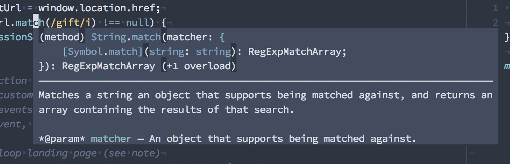
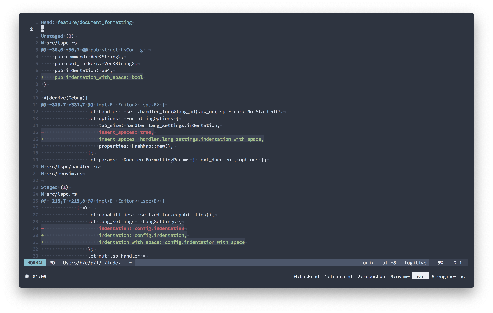
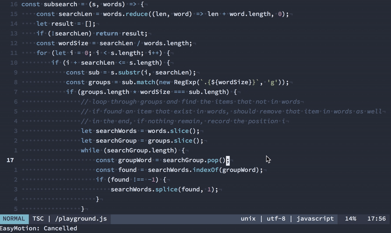

**Lưu ý:** Bài viết này không dành cho những bạn chưa biết gì về Vim, nếu bạn chưa biết xài Vim, không sao, hãy dành ra [5 phút để làm quen](https://kipalog.com/posts/Lam-quen-VIM-trong-5-phut) với nó và thêm 10 phút nữa để [học cách cấu hình nó](https://kipalog.com/posts/Di-cu-tu-Sublime-Text-sang-VIM), xong rồi hãy quay lại đọc bài này :smirk:.

---

Sau gần 2 năm xài Emacs thì giờ mình đã quay trở lại xài Vim, chính xác là Neovim.

## Lời tự thú của một traitor


<div class="center copyright">Tên của các nhân vật trong bài chưa được thay đổi</div>

Lý do? Rất đơn giản, vì Emacs quá xịn và có quá nhiều chức năng, khả năng mở rộng quá tuyệt vời, nên mình tốn quá nhiều thời gian vào việc ngồi customize cho nó, thay vì ngồi làm những việc mình cần phải làm :joy:.

Đùa vui tí, thực ra nguyên nhân sâu xa hơn thế. Lý do lớn nhất khiến mình chuyển từ Vim sang Emacs đó là, nó có GUI mode, đem tới khả năng hiển thị các ứng dụng trên môi trường đồ họa tốt hơn như là browser, terminal tích hợp tốt hơn nên mình hy vọng phần nào nó sẽ cải thiện được quy trình làm việc của mình. Sau 2 năm sử dụng, thì những thứ mình kỳ vọng hóa ra nó không thực sự hoàn hảo, GUI client trên macOS quá tệ đem lại trải nghiệm không được tốt cho lắm. Phải chi mình xài Linux toàn thời gian thì đã khác.

Sau khi dẹp Emacs thì mình qua xài VSCode vì nó có vẻ là editor cực kì xịn, ngay cả khi chưa cần config gì nhiều, và mình cũng kịp publish được [hai](https://marketplace.visualstudio.com/items?itemName=huytd.vscode-diff) [cái](https://marketplace.visualstudio.com/items?itemName=huytd.searchy-fuzzy) plugin trước khi dẹp luôn nó qua một bên, vì cái máy tính mình xài cũng không chịu nổi chuyện chạy nguyên cái trình duyệt Chromium cho mỗi cửa sổ gõ code.

Vừa hay đúng thời điểm này thì [Neovim release phiên bản 0.4.0](https://github.com/neovim/neovim/commit/e2cc5fe09d98ce1ccaaa666a835c896805ccc196), có thể coi đây là phiên bản được mong đợi nhất vì có khá nhiều update quan trọng, như `lua-stdlib`, hay một loạt các cải tiến về UI, và quan trọng nhất là hỗ trợ `floating window` -- một tính năng xưa như trái đất ở các GUI-based editor nhưng là dấu mốc quan trọng của Neovim -- giúp hiển thị popup chứa nội dung, như là document cho một function, hay type signature của một giá trị.



Với chức năng này, thì chúng ta có thể dễ dàng cấu hình cho Vim (hoặc Neovim) để đem lại trải nghiệm không thua gì VSCode. Sau đây mình sẽ giới thiệu về cách mình config Vim để sử dụng cho công việc hằng ngày. Và không có lý do gì để mình không quay lại Vim nữa.

## Vim chạy trong terminal, lag thấy bà

Hẳn là bạn đang xài một cái terminal emulator cùi bắp, kiểu như `Apple Terminal` hoặc tệ hơn là `iTerm 2`.

Nếu quả đúng là như thế, thì các bạn có thể thử [Alacritty](https://github.com/jwilm/alacritty), một terminal emulator viết bằng Rust và render bằng GPU, nó hơi ngốn pin một tí nhưng tin mình đi, nó đem lại trải nghiệm cực kì tốt.

`iTerm 2` nghe đồn cũng đã có GPU rendering, nhưng mà Alacritty dễ config hơn, vả lại nó còn cross platform, cho nên nếu cần thì mình vẫn có thể bê nguyên cái setup này qua Linux mà không phải đắn đo suy nghĩ.

## Language Server Protocol (LSP) và Neovim

Trong trường hợp bạn không biết, thì lý do khiến VSCode trở nên phổ biến, đặc biệt là với các lập trình viên JavaScript/TypeScript đó là nhờ khả năng support với nhiều ngôn ngữ lập trình cực kì hiệu quả, hay nói cách khác là nhờ nó tích hợp một cái [LSP](https://microsoft.github.io/language-server-protocol/) client cực kì xịn.

Điều này khá là dễ hiểu, vì cả LSP lẫn VSCode đều được làm ra bởi Microsoft, mặc dù là 2 team khác nhau.

Nói về LSP, nó là phương thức giúp cho các code editor có thể giao tiếp với các `language server` -- là các ứng dụng hỗ trợ cho các code editor thực hiện các chức năng như auto complete, go to definition, hiển thị document hay type signature.

Và hầu hết các editor hiện có đều đã có LSP client của riêng nó. Tất nhiên Vim/Neovim cũng có.

Sau khi thử nghiệm một vài LSP client khác nhau cho Neovim, thì mình quyết định sẽ chọn [coc.nvim](https://github.com/neoclide/coc.nvim), khi mà bản thân nó vừa là LSP Client, vừa cung cấp chức năng auto complete, và thế là mình khỏi phải cài `deoplete` hay `YouCompleteMe` luôn.

Thêm nữa, `coc.nvim` đã support floating window của Neovim 0.4.0, chính vì thế, về mặt UI thì bạn hoàn toàn yên tâm, không thua gì VSCode.

Bên cạnh chức năng cơ bản của LSP client như auto complete, go to definition, find references, `coc.nvim` còn cung cấp nhiều tính năng khá là hữu ích khác như nhảy nhanh tới một symbol/function trong file source (giống như `Go to Symbol` của VSCode hay Sublime):

```
" Press Ctrl + O to jump to a symbol
nnoremap <C-o> :CocList outline<CR>
```

Hoặc một tính năng khác khá hay ho đó là thêm định nghĩa cho function text object của Vim, nếu bạn từng dùng các tổ hợp phím `i)`, `i"` hay `aw` (thao tác với nội dung bên trong các cặp dấu nháy `()`, hay `""` hay trên một từ, đoạn văn), thì giờ đây chúng ta còn có `if` và `af` để thao tác trên một function:

```
" Create mappings for function text object, requires
" document symbols feature of languageserver.
xmap if <Plug>(coc-funcobj-i)
xmap af <Plug>(coc-funcobj-a)
omap if <Plug>(coc-funcobj-i)
omap af <Plug>(coc-funcobj-a)
```

Ngoài mấy cái này ra, bạn có thể copy cấu hình mặc định được cung cấp trong file README của `coc.nvim`.

Khi cài xong, đừng quên chạy lệnh cài các gói language bạn cần, ví dụ mình thường code JavaScript/TypeScript và Rust, nên sẽ cài `coc-tsserver` và `coc-rls`:

```
:CocInstall coc-tsserver
:CocInstall coc-rls
```

## Tích hợp Git trong Vim

Khi không dùng Emacs nữa thì tính năng mình nhớ nhất của nó là tích hợp Git, nếu đã từng xài `Magit` của Emacs thì bạn sẽ biết nó lợi hại đến thế nào.

Trong Vim, chúng ta có [fugitive.vim](https://github.com/tpope/vim-fugitive), mặc dù không bằng Magit của Emacs, nhưng bạn vẫn có thể thực hiện các thao tác xem git status, stage hoặc commit từng đoạn (hunk), push code ngay trên Vim.



Ví dụ như hình trên là màn hình `:Gstatus` của `fugitive.vim`, hiển thị 3 đoạn thay đổi trong file `src/lspc.rs`, trong đó có 1 đoạn đã được staged.

## Terminal tích hợp

Một thói quen mà mình bị nhiễm khi sử dụng Emacs và VSCode đó là thường xuyên mở một cửa sổ terminal mới từ ngay bên trong editor, chỉ bởi vì 2 editor này có terminal emulator khá tốt.

Còn terminal emulator trong Vim/Neovim thì tệ hết chỗ nói. Cho nên giải pháp của mình là xài `tmux`, hoặc lúc nào lười tạo một window mới trong `tmux`, thì mình làm như sau:

- Bấm `Ctrl + Z` để tạm dừng Vim, đưa nó thành một background process.
- Lúc này terminal đã trống, có thể làm gì với nó tùy thích, thậm chí có thể `cd` ra ngoài thư mục khác.
- Khi cần quay lại Vim, gõ `fg` để khôi phục nó thành process đang chạy.

## Di chuyển nhanh hơn

Một căn bệnh mà mình bị nhiễm từ trước khi bỏ Vim qua xài Emacs, đó là bò từ dòng này sang dòng khác, từng dòng một, tương tự với việc di chuyển từ kí tự này sang kí tự khác trên 1 dòng. Việc này mất khá nhiều thời gian, là những động tác thừa không cần thiết, đôi khi còn gây mất tập trung.

Một giải pháp đó là sử dụng [vim-easymotion](https://github.com/easymotion/vim-easymotion), giúp chúng ta nhảy nhanh đến một từ hoặc một kí tự trên màn hình:



Ở ví dụ trên, mình thực hiện lệnh nhảy đến một kí tự trên màn hình, bằng tổ hợp phím `;;`, được cấu hình như sau:

```
" Vim easymotion
nmap <silent> ;; <Plug>(easymotion-overwin-f)
nmap <silent> ;l <Plug>(easymotion-overwin-line)
```

Ngoài ra, lệnh nhảy tới/lui đến một kí tự trong cùng một dòng, dùng `f<kí tự>` và `F<kí tự>` cũng sẽ khá hữu ích và giúp tiết kiệm thời gian.

---

Trên đây là một vài dòng giới thiệu ngắn về những gì mình sử dụng cho Vim. Thực ra viết tới đây rồi thì mình không biết phải kết bài như nào cho nó hay, nên thôi cứ kết bà nó luôn.

Nếu quan tâm, các bạn có thể sử dụng vim config của mình tại đây https://github.com/huytd/vim-config

Có hai cách để sử dụng `vim-config` trên của mình:

1. Xem file `init.vim` và copy phần nào bạn thích
2. Nếu lười, bạn có thể clone toàn bộ repo về thư mục `~/.config/nvim`, và make sure bạn đã backup thư mục `nvim` của bạn trước khi làm điều này, như sau (nhớ đọc kĩ từng dòng lệnh, hãy hành động có trách nhiệm :joy:)
  ```
  $ cp -rf ~/.config/nvim/ ~/.config/backup.nvim/
  $ rm -rf ~/.config/nvim
  $ git clone https://github.com/huytd/vim-config ~/.config/nvim/
  ```
