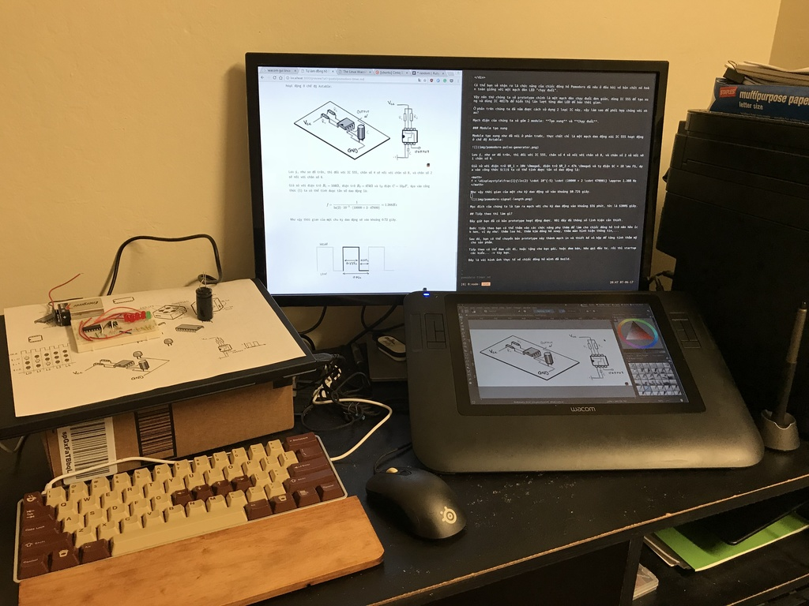
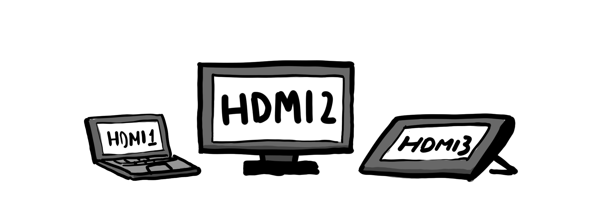
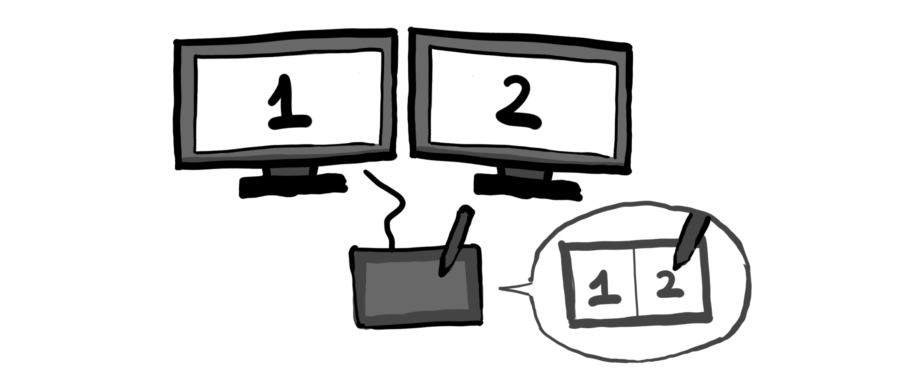
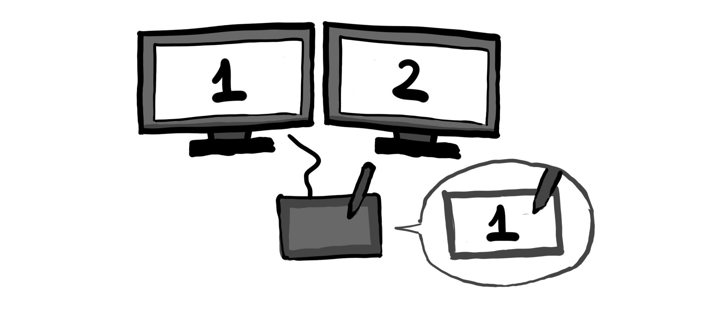

# Cấu hình Wacom cho Linux

Trong bài viết này mình ghi lại cách cài đặt cho 2 loại Wacom là Intuos và Cintiq trên môi trường Archlinux.

Các model khác nhau đều có cách cài đặt cơ bản là giống nhau. Các Linux distro khác cũng có cách cài đặt tương tự (chỉ khác nhau về package manager).



## Cài đặt driver

Có một điểm khá xịn đó là hầu như 99.99% các distro Linux phổ biến hiện nay đều đã tích hợp đầy đủ driver cho các bàn vẽ của Wacom (và tất nhiên là nhiều hãng khác nữa). Nên chúng ta không cần cài gì cả.

## Sắp xếp vị trí màn hình

Phần này chỉ dành cho Cintiq.

Mặc định Linux sẽ tự động mirror màn hình hiện tại với màn hình của Cintiq, để hiển thị 2 bên 2 là 2 màn hình khác nhau, ta dùng `xrandr`. Có thể gõ trực tiếp lệnh này để xem danh sách các màn hình đã cắm vào máy tính.



Giả sử chúng ta có 1 màn hình chính cắm ở cổng `HDMI2` và Cintiq cắm ở cổng `HDMI3`:

```
xrandr --output HDMI2 --auto --primary --prefered --output HDMI3 --right-of HDMI2 --auto
```

Tham số `--right-of HDMI2` sẽ đưa màn hình `HDMI3` về phía bên phải của `HDMI2`. Tham số `--auto` có nghĩa là lựa chọn độ phân giải tự động.

## Giới hạn vùng hoạt động của Wacom

Một trong những vấn đề thường gặp nhất khi sử dụng bàn vẽ trên máy tính có nhiều hơn 1 màn hình đó là hiện tượng toàn bộ bề mặt bàn vẽ bị map cho vừa với kích thước của cả 2 màn hình.



Để giải quyết vấn đề này, chúng ta sử dụng lệnh `xsetwacom`, là lệnh chính khi cần thay đổi những thiết lập liên quan đến Wacom.

Đầu tiên lấy danh sách các thiết bị Wacom đang kết nối với máy tính:

```
xsetwacom --list devices
```

Đối với trường hợp của Cintiq 12wx thì output sẽ là:

```
Wacom Cintiq 12WX Pen stylus            id: 12  type: STYLUS
Wacom Cintiq 12WX Pad pad               id: 13  type: PAD
Wacom Cintiq 12WX Pen eraser            id: 19  type: ERASER
```

Tiếp đến là giới hạn vùng hoạt  động của 3 thiết bị trên vào màn hình số 3 (`HDMI3`):

```
xsetwacom --set 12 MapToOutput "HDMI3"
xsetwacom --set 13 MapToOutput "HDMI3"
xsetwacom --set 19 MapToOutput "HDMI3"
```

Xong rồi thì problem fixed :D



Ngoài ra, còn có các cách thiết lập khác, như map lại phím, có thể xem chi tiết tại đây: https://technonaturalist.net/blog/2014/11/setting-wacom-cintiq-12wx-ubuntu-studio-1404

--@TAGS: random
